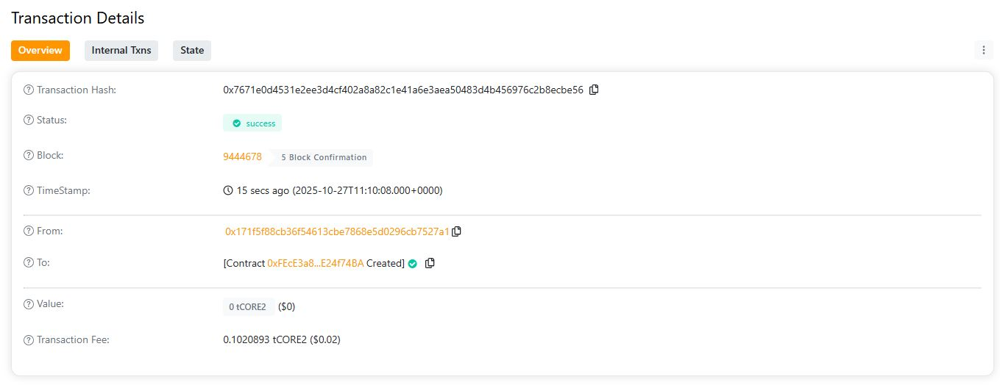

# ChainLattice
 
## Project Description
**ChainLattice** is a decentralized asset registry that enables users to **record, verify, and transfer ownership** of digital assets securely on the blockchain.  
Each asset is represented by its **unique hash** and accompanied by a metadata URI, allowing immutable proof of creation and ownership  transfer.

---

## Project Vision
The vision of **ChainLattice** is to create a **trustless digital asset verification network** where ownership and authenticity are transparent, verifiable, and permanently stored on-chain — empowering creators, developers, and businesses to safeguard intellectual property and digital assets.

---

## Key Features
- 🔗 **Decentralized Asset Registration:** Record assets using their unique cryptographic hash.
- 👤 **Ownership Tracking:** Verify and manage asset ownership directly on-chain.
- 🔄 **Transferable Records:** Enable transparent asset handovers between parties.
- ⏱️ **Timestamp Verification:** Immutable proof of registration time and owner.
- 📂 **Metadata Integration:** Attach an external URI to describe each asset.

---

## Future Scope
- 🧠 Integration with **IPFS** or **Arweave** for decentralized storage of metadata.
- 💰 Implementation of an **NFT-based asset tokenization** system.
- 🔒 Role-based access control for enterprise-grade data management.
- 🌐 Expansion to **multi-chain interoperability** across Ethereum, Polygon, and Arbitrum.
- 📱 Development of a **DApp interface** for user-friendly asset management.

---

### 🧠 Tech Stack
- **Language:** Solidity (`^0.8.20`)
- **Framework:** Hardhat
- **Network:** Ethereum / Polygon / Sepolia

---

### 🚀 How to Deploy (Using Hardhat)
1. **Install Dependencies**

   npm install
2. Compile the Contract

npx hardhat compile
3. Deploy Locally

npx hardhat run scripts/deploy.js
4. Deploy to a Testnet

npx hardhat run scripts/deploy.js --network sepolia

License: MIT
Project Name: ChainLattice

H address:0x7671e0d4531e2ee3d4cf402a8a82c1e41a6e3aea50483d4b456976c2b8ecbe56

